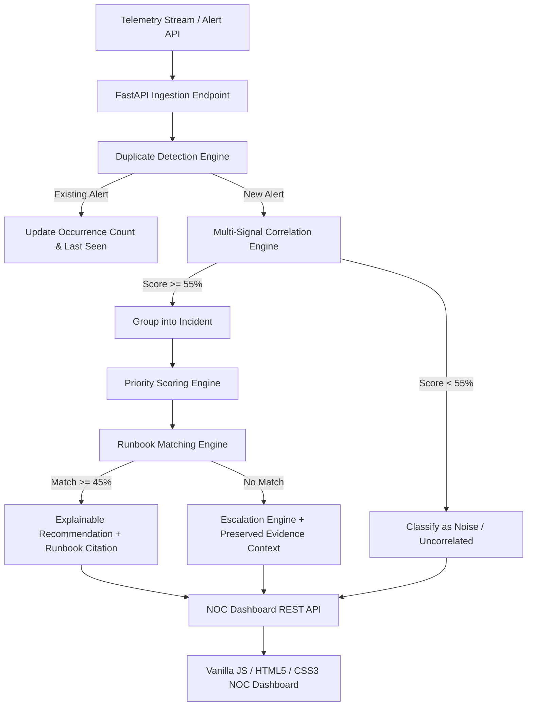

# AI Network Incident Triage Assistant

An intelligent, full-stack Network Operations Center (NOC) triage platform designed to automatically deduplicate telemetry alerts, correlate multi-signal network events into prioritized incidents, match root cause symptoms against operational runbooks, generate explainable recommendations, classify noise, and preserve evidence context during L3 team escalations.

---

## 1. Problem Statement

Modern Network Operations Centers (NOCs) are overwhelmed by thousands of raw network alerts, interface state traps, and telemetry logs daily. Standard monitoring systems fail to correlate co-occurring events, causing **alert fatigue**, delayed root cause identification, and prolonged Mean Time to Resolution (MTTR). During major network outages, NOC engineers are forced to manually sift through duplicate router/switch logs and execute trial-and-error troubleshooting.

## 2. Solution

The **AI Network Incident Triage Assistant** provides an automated, multi-signal triage engine:
1. **Deduplication Engine**: Combines duplicate rapid-fire alerts without losing event count, first-seen, or last-seen timestamps.
2. **Multi-Signal Correlation Engine**: Evaluates device topology, time windows (0–2m, 2–5m, 5–10m), IP subnets, alert type patterns, and message signatures to group related alerts into unified Incidents.
3. **Priority Engine**: Computes severity, impacted user/device count, latency, packet loss, and critical infrastructure tags to assign `CRITICAL`, `HIGH`, `MEDIUM`, or `LOW` priority with natural language justifications.
4. **Explainable Runbook Matching**: Compares incident symptom profiles against local JSON runbooks, producing transparent recommendations (Action, "Why", Runbook Citation, and Match Confidence %).
5. **Noise Classification**: Flags isolated alerts below the correlation threshold as noise, presenting explicit reasons to avoid operator distraction.
6. **Context-Preserving Escalations**: When no runbook matches an incident, an escalation record is automatically created, packaging all grouped alert timelines, telemetry metrics, and assigned L3 engineering teams.

---

## 3. Architecture



---

## 4. Technology Stack

- **Backend**: Python 3.11+, FastAPI, Pydantic v2, SQLAlchemy 2.0, Uvicorn, SQLite
- **Frontend**: Vanilla HTML5, CSS3 (NOC Cyber Dark Theme), Vanilla JavaScript (Fetch API, Async ES6)
- **API Specification**: OpenAPI 3.0 / Swagger UI (`/docs`)

---

## 5. Project Structure

```text
network-triage-assistant/
├── backend/
│   ├── main.py                     # FastAPI application entry point
│   ├── requirements.txt            # Python dependencies
│   ├── database.py                # SQLAlchemy engine & SQLite configuration
│   ├── models.py                  # SQLAlchemy ORM models (AlertDB, IncidentDB, RunbookDB, EscalationDB)
│   ├── schemas.py                 # Pydantic schemas for request validation & serialization
│   │
│   ├── api/
│   │   ├── alerts.py              # Alert ingestion, duplicate check & retrieval
│   │   ├── incidents.py           # Incident list & detail view with timeline & explainability
│   │   ├── runbooks.py            # Knowledge base runbook endpoints
│   │   ├── escalations.py         # Escalation management endpoints
│   │   ├── dashboard.py           # Top KPI stats & real-time activity stream
│   │   └── demo.py                # Visual transformation flow & stream simulation
│   │
│   ├── services/
│   │   ├── correlation_engine.py  # Multi-signal scoring algorithm & duplicate detection
│   │   ├── priority_engine.py     # Priority calculation & natural language justification
│   │   ├── runbook_engine.py      # Symptom matching & explainable recommendation generation
│   │   └── escalation_engine.py   # Context-preserving escalation packager
│   │
│   ├── runbooks/
│   │   ├── connectivity.json      # Network link failure runbook
│   │   ├── latency.json           # High latency & packet loss runbook
│   │   ├── authentication.json   # TACACS+/RADIUS auth failure runbook
│   │   └── device_failure.json    # Hardware failure runbook
│   │
│   └── seed_data.py               # Pre-populates DB with 30+ alerts, 5 incidents, 5 noise, 1 escalation
│
├── frontend/
│   ├── index.html                 # Main NOC Dashboard View
│   ├── incidents.html             # Incident Management View
│   ├── alerts.html                # Telemetry Alert Stream & Noise View
│   ├── runbooks.html              # Knowledge Base SOP View
│   ├── escalations.html           # L3 Escalation Records View
│   │
│   ├── css/
│   │   └── style.css              # NOC dark cyber theme stylesheet
│   │
│   └── js/
│       ├── api.js                 # Centralized fetch API client wrapper
│       ├── dashboard.js           # Dashboard controller & live stream simulator
│       ├── incidents.js           # Incidents controller & filter logic
│       ├── alerts.js              # Alerts controller & noise breakdown
│       ├── runbooks.js            # Runbook knowledge base renderer
│       └── escalations.js         # Escalation records & evidence viewer
│
└── README.md                      # Project documentation
```

---

## 6. Installation & Startup Instructions

### Prerequisites
- Python 3.11+ installed on system.
- Web browser (Chrome, Edge, Firefox).

### Backend Startup

1. Open a terminal and navigate to the backend directory:
   ```bash
   cd network-triage-assistant/backend
   ```
2. Install dependencies:
   ```bash
   pip install -r requirements.txt
   ```
3. Start the FastAPI server using Uvicorn:
   ```bash
   uvicorn main:app --reload
   ```
4. Access Swagger API documentation at:
   [http://localhost:8000/docs](http://localhost:8000/docs)

### Frontend Startup

Simply open `frontend/index.html` in any web browser, or serve using Python's static HTTP server:
```bash
cd network-triage-assistant/frontend
python -m http.server 3000
```
Open [http://localhost:3000](http://localhost:3000) in your browser.

---

## 7. Key Algorithms Explanation

### Correlation Engine Algorithm
Computes a multi-signal score $S \in [0, 100]$:
$$S = S_{\text{device}} + S_{\text{time}} + S_{\text{network}} + S_{\text{pattern}} + S_{\text{message}}$$
- **Device Signal ($S_{\text{device}}$)**: $+35$ for exact device match; $+20$ for topology group match.
- **Time Window Signal ($S_{\text{time}}$)**: $+35$ (0–2m), $+25$ (2–5m), $+15$ (5–10m), $+5$ (>10m).
- **Network Topology Signal ($S_{\text{network}}$)**: $+20$ for source/destination IP link match.
- **Alert Pattern Signal ($S_{\text{pattern}}$)**: $+30$ for co-occurring alert combinations (e.g. `device_unreachable` + `link_down` + `packet_loss`).
- **Message Signature ($S_{\text{message}}$)**: $+15$ for overlapping log tokens.

Threshold = **55.0**. Alerts above threshold group into an Incident; alerts below remain classified as **Noise**.

### Explainable Runbook Engine Algorithm
Extracts symptom features (alert types, packet loss %, latency ms, auth failure count) and calculates a match ratio against operational runbook rules. Output structure:
- **Recommended Action**: Primary troubleshooting step.
- **Why**: Explicit bulleted list of triggers (e.g. "RTR-01 unreachable", "Packet loss reached 85%").
- **Citation**: Clickable runbook source link.
- **Match Confidence**: Percentage score.

---

## 8. Demo Scenario Workflow

1. Click **✨ Run Demo Scenario** on the Dashboard.
2. The application simulates the full pipeline:
   ```text
   10 Raw Alerts Arrive
          ↓
   3 Duplicate Alerts Aggregated
          ↓
   1 Correlated Incident Formed (INC-1001)
          ↓
   1 Noise Alert Flagged (Printer Spool)
          ↓
   Priority Calculated: CRITICAL
          ↓
   Runbook Matched: Network Link Failure (94% Confidence)
          ↓
   Explainable Recommendation Displayed
   ```

---

## 9. Future Improvements

- Integration with WebSockets for true server-push telemetry streams.
- Machine Learning (LLM / RAG) model integration for automated root cause summary generation.
- Automated webhooks to PagerDuty / Jira Service Management.
